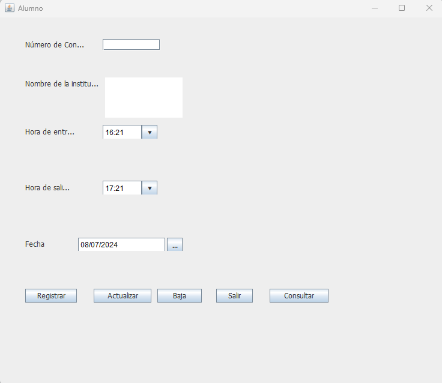

# BitacoraCecytem

Programa en java puro que permite consultar datos a partir de un número de control,hacer nuevos registros,eliminar registros y actualizarlos de igual forma visualizarlos a la hora de consultar.

## Funcionalidad

Bitacora que permite guardar registros de alumnos mediante numero de control de igual forma consultar eliminar y modificar registros

**Interfaz:**

## Campos

Número de control: Permite ingresar un número de control único ya que este no se puede duplicar de igual forma solo permite letras ,números y valores de 10 caracteres.

Nombre de la institución: Permite Ingresar el nombre de la institución como su nombre lo menciona tiene un limite de 100 caracteres y de igual forma no permite caracteres especiales solo letras números espacios comas puntos acentos y tildes.

Hora entrada y salida: Campos que estan precargados con la hora actual y una hora adelantada a la actual ya que esta se puede modificar.

Fecha:Fecha actual del día de hoy precargada con el formato dd/mm/yyyy.

## Botones:

Registrar: Permite ingresar los datos proporcionados en la interfaz y se guardan en una tabla almacenada en mysql.

Actualizar: Permite modificar los datos ya que estos se visualizaran depues de realizar una consulta con el botón consultar.

Baja : Elimina los datos apartir de un  número de control de la base de datos.

Salir: Permite salir del programa

Consultar permite consultar los datos y los llena en sus campos respectivos ya que permite modificarlos solamente.
